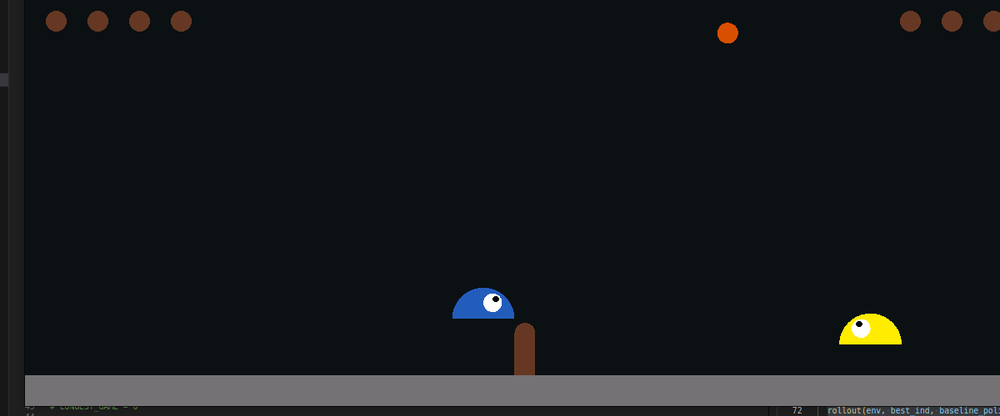
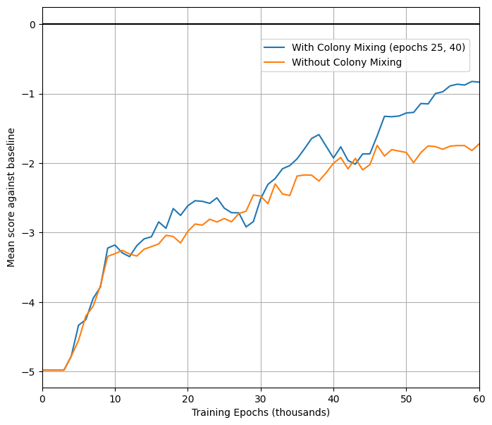
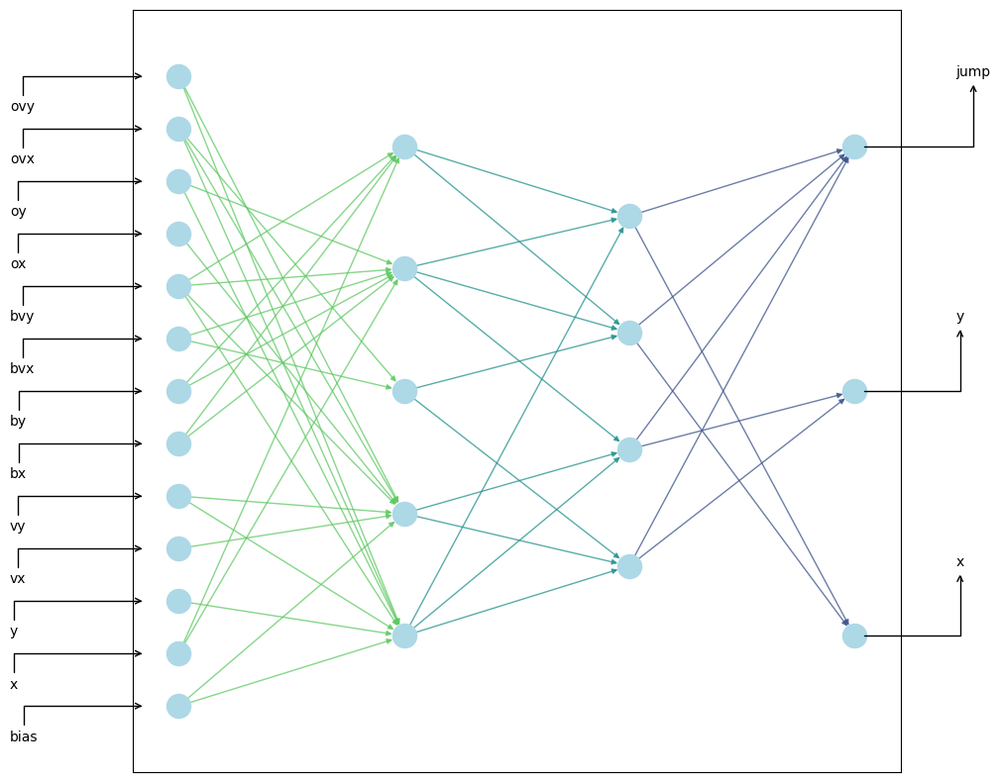
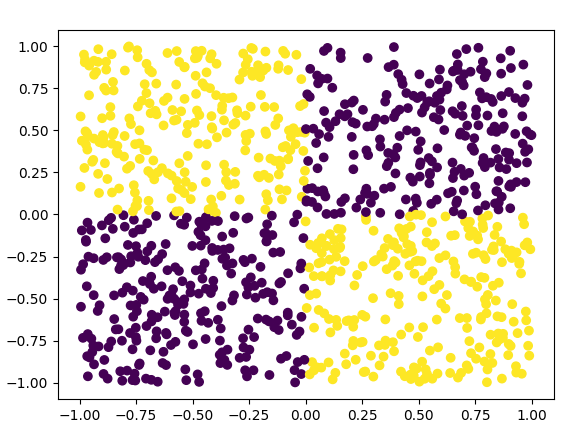
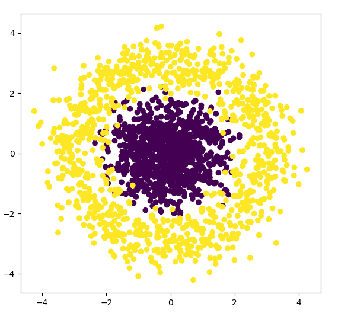
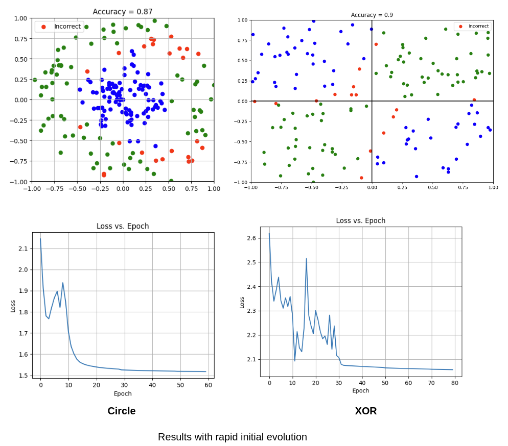
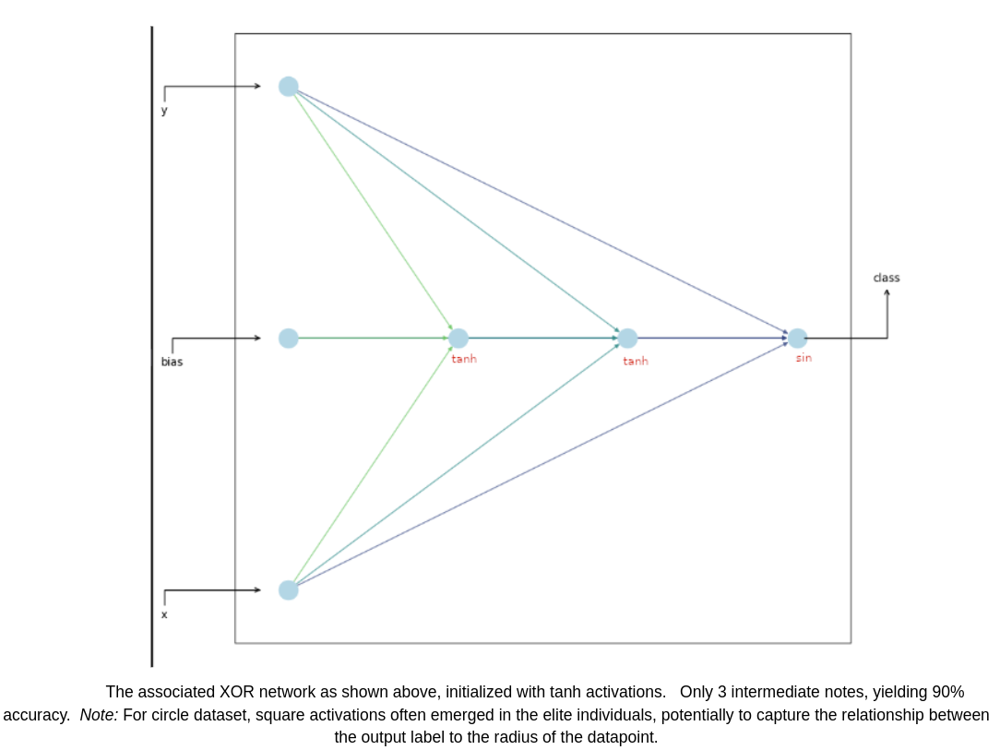

# Autonomous Evolution of NN Architecture 

In these two parts, we will employ [NEAT](https://nn.cs.utexas.edu/downloads/papers/stanley.ec02.pdf) (NeuroEvolution of Augmenting Topologies), an intriguing paradigm to solving complex reinforcement learning tasks.  In Part 1, we train an agent to beat a robust internal agent in the task of Slime Volleyball (forked from WANN workshop and David Ha).  In Part 2, we do the same, but instead implement backpropogation (using Jax) to solve in parameter space.  Thus evolution only modulates _architecture only_.

# Part 1: Slime volleyball

### Getting Started
I found the most straightforward path was to maneuver the core source code of WANNrelease to work with the Slimevolley environment created by David. This provided a great toolkit to start and to minimize sources of error as I begin experiments.  Most of my code is in [slimevolley/trainingscripts](slimevolleygym/training_scripts), config.json.  Minor changes to neat.py, ind.py, slimevolley.py to allow the marriage between WANNrelease and slimevolley.  

### Reaching convergence
Initial experiments experienced slow training, thus a few actions were taken to resolve this.
* Building [multiprocessing code](slimevolleygym/training_scripts/train_neat_selfplay.py#L22) into the training script to utilize ~12 CPU cores for parallel evaluation of each individual. We then haul the results to the main process and update the population.
* Introducing auxiliary reward functions to “hand-hold” the model to success.  Not every 5-0 loss is the same – we want to reward agents that performed valiantly, even if they still lost by a large margin.  **Auxiliary rewards introduce ‘signal’ into our training pipeline that may not appear on the scoreboard**
     1. Surviving - A tool spotted in reference code.  By simply surviving, the agent learns to hit the ball earlier and often.  
     2. Distance shots - We reward shots that force the opponent to move laterally.  Reason: After using ‘survival’ as the main source signal, the agent becomes competent at tracking the ball and extending the game.  However, it fails to make its offensive shots difficult for the opponent.  (See gif1)
     3. Penalize over-jumping - In the mid-late training era, we observe that our opponent compulsively jumps.  Which seems fine, and maybe just a nervous tick by our agent.  We all have those ;(.   However, in moments requiring precise movement, the compulsive jumping leads to a suboptimal position for the agent – this leads to suboptimal hits and even sometimes a lost point.  We introduce this as a small negative-reward.

We add rewards directly to [Slimevolley.py](slimevolleygym/slimevolleygym/slimevolley.py#L747C1-L761C33)
```python
  @property
  def survival_bonus(self):
    return self._survival_bonus

  @survival_bonus.setter
  def survival_bonus(self, bonus:float=0.01):
    self._survival_bonus = bonus

  @property
  def distance_bonus(self):
    return self._distance_bonus

  @distance_bonus.setter
  def distance_bonus(self, bonus:float=0.01):
    self._distance_bonus = bonus
```
And in the [training loop](slimevolleygym/slimevolleygym/slimevolley.py#L962) we can track rewards as the game evolves 
```python
    # Auxiliary rewards
    distance_traveled += np.linalg.norm(np.array(action_left[:2]))
    jumping_traveled += action_right[-1]
    t += 1
```



<div align="center">
  Survival-only agent, spending too much time on its own cour
</div>

$${\color{blue}Baseline \space on \space left}, \space {\color{yellow}Custom \space agent \space on \space right}$$


<div align="center">
     Distance-rewarded agent.  More eager to get the ball deep on the opponent’s court
</div>

$${\color{blue}Baseline \space on \space left}, \space {\color{yellow}Custom \space agent \space on \space right}$$


### Intercolony battles

For a new exploration, I drew inspiration from anthropology.  We know that in the stories of our evolution, human colonies were separated geographically and in different environments, and thus evolved in unique ways.  After thousands of years they may come in contact with each other.  Two disparate gene pools would often battle or interbreed.  

It seems compelling that one can take several populations, spawned with different random seeds, and have them evolve in isolation from each other.  After a certain number of epochs, two uniquely evolved populations can engage in a round-robin Slime tournament against each other, whereby the top performing half of individuals from each population are conjoined into a single population.  **This allows several potentially promising architectures to cross-pollinate and leverage dominant genes from each other.**  Thereafter, they evolve as one. 

We implement the colony round-robin [code](slimevolleygym/training_scripts/train_utils.py#L74) and compare to our baseline experiments.  

 

*NEAT performance as a function of epoch for experiments with and without colony mixing.  Colony mixing at epochs 25,40*

The final architecture is shown below, with an average score against baseline of  -0.93 ± 0.2.  Though the model was free to mutate activations (albeit a low mutation probability of 0.03), it stuck close to its tanh initial activation function.  As suggested by the original NEAT paper, no additional loss functions were employed to prevent overgrowth of architectures.  Rather we controlled this implicitly via mutation parameters.

9 total intermediate nodes
 - 5 tanh
 - 1 square
 - 1 abs
 - 2 sin

 

*Final architecture of highest performing individual, 60k epochs. Plotting code in [playground.ipynb](slimevolleygym/playground.ipynb)*


-----------------------------------------------------------------------


# Part 2: Backprop NEAT

This one was quite fun.  I used the same WANNrelease backbone to bounce off of, and employed JAX to trace feed-forward computations and loss measurements such that gradients were easily obtainable.  These gradients were verified with custom derivative calculations in engine.py (attached).  Additionally, the shapes were locally generated in Python [generateShapes.py](backpropneat/sky_src/generateShapes.py#L5). 
Majority of code is in [/sky_src](backpropneat/sky_src), with engine.py containing the meat of training, derivatives, loss fns.  Training [script](backpropneat/training_scripts/neat_2d.py) is found in training_scripts/.  This code should be ready to run. 

XOR Dataset             |  Circle Dataset
:----------------------:|:---------------------------:
  |  


### Some initial thoughts on backprop neat
 - BCE Loss - Given the binary classification problem, binary cross entropy loss can be employed.  For the circle dataset in particular, where the class is largely correlated to the euclidean norm (radius) of the (x,y) coordinate, L2 loss is an intriguing auxiliary loss too.  
 - Stochastic gradient descent seems a good choice in this particular problem (although unconventional in typical ML problems these days).  Because of the low-intermediate noise of the dataset, as we traverse the parameter-loss topology, our parameters move towards a local minima with solid confidence (it is less likely that low-intermediate noise will cause a learning step in the opposite direction).  SGD, with a small batch size of 5, allowed quick convergence and thus rapid experimentation. 
 - Drawing inspiration from nature, I propose an alternative strategy to prevent the model architectures from becoming exceedingly large / complex.  Rather than explicitly penalizing this in the loss function, allow the population to dynamically adjust its likelihood of mutations, which we can call *mutational temperature*.  At t=0, the networks are too simple to nail down these non-linear (albeit simple) tasks.  Thus, allow the population to rapidly evolve until the networks become minimally sufficient.  Then, lower the mutational temperature exponentially.  
This is reminiscent of the fact that early species, if not robust to their environment, will have short life spans and are forced to reproduce earlier and often.  We can decrease the time cycle of evolution by faster mutations.  We can also think of infectious agents -- viruses increase their mutational temperature when placed into largely fatal environments.  In clinical settings, as viruses are introduced to new antibodies and therapies (which they have low fitness against), mutations become more frequent as the population is put under constant pressure.  To take inspiration from this, we impose ‘high pressure’ at early epochs and thus artificially introduce high temperatures to the initially weak and overly-simple population at t=0.  As time goes on, we exponentially decay mutational temperature (prob_addConn, prob_addNode, prob_mutAct, etc).  
Each of these mutation levers follow an exponential decay: with t = epoch and $P_0$ , $P_{10}$  as desired boundary conditions.  Suppose the case where we want 10x reduction in mutational temperature every 10 epochs.

$P_t = P_0 e^{-kt}$

Boundary Conditions
 - $P_0  = 0.5$
 - $P_{10} = P_0 / 10$ 

  => $P_t  = 0.5 e^{-ln(10) / 10 t}$
  




Within 20 minutes on a single process, we converge to the above results.  I also considered several common optimizations with some thoughts below.. 

* Momentum – To help ‘push’ our parameters out of local minima, an Adam optimizer was introduced ([implemented](backpropneat/sky_src/engine.py#L206) in engine.py), however only marginal improvements emerged.
* Batch normalization – Although considered for a moment, performing batchnorm on such a small batch size (BS = 5), would only confuse training.  Such a small sample of data does not represent the true distribution of the dataset, thus a normalization only misleads the network.   
* Learning rate annealing – After some trouble with converging in early experiments, a learning rate scheduler, where the rate decays exponentially with respect to epoch, helped inform the model of a proper learning rate to use.  This learning rate (6e-4) was chosen and set constant when starting experimentation with the Initial Rapid Evolution methodology.
  
All in all, this problem was a blast with vast potential to iterate and improve upon!
